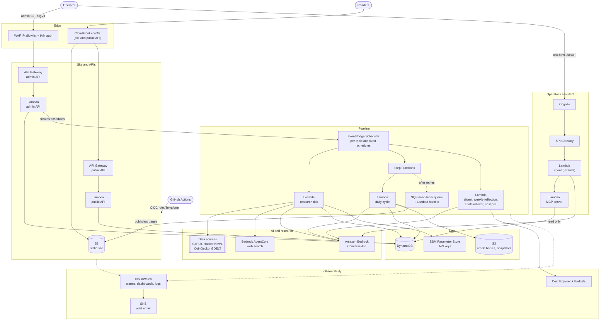

# BloggerBear

An autonomous, multi-domain research-and-publishing platform on AWS. You configure "topics" (a
data source plus an adapter for it); each topic runs two unattended cadences: a research tick
that watches its source for material change, and a daily authoring cycle that turns fresh
findings into a reviewed, published article. A local admin CLI manages topics and moderation. A
public static site serves the results, with RSS for anything that wants to read it by program.

It is open source so you can read it, learn from it, and run your own copy. The original
deployment is live at [bloggerbear.com](https://bloggerbear.com).

## Quick start

To run your own copy you need an AWS account (two is better: one for dev, one for production), a
fork of this repository, Terraform, the AWS CLI, Python 3.11+ and the GitHub CLI.

1. **Bootstrap AWS, once, from your own machine.** This creates the Terraform state bucket and
   the roles GitHub deploys with:
   ```bash
   cd infra/bootstrap && terraform init
   terraform apply -var="github_repo=your-name/your-fork" \
     -var="state_bucket_name=yourname-bloggerbear-terraform-state" \
     -var="unique_name_prefix=acme-blog" -var="domain_name="
   ```
   `unique_name_prefix` is what every resource name starts with (`acme-blog-dev-topics`). Pick
   your own, and give the setup script the same word when it asks for `UNIQUE_NAME_PREFIX`.
2. **Run the setup script.** It asks for every GitHub secret and variable a deployment needs,
   checks each answer, and sets them. Start with the dry run, which changes nothing:
   ```bash
   python scripts/setup_repo.py --dry-run
   python scripts/setup_repo.py
   ```
3. **Merge a pull request into `dev`.** GitHub Actions runs the security scans, lint and tests,
   then deploys the dev environment.
4. **Seed a topic** with the admin CLI, and it runs by itself from there. The admin CLI quick
   start ([scripts/QUICKSTART.md](scripts/QUICKSTART.md)) points the CLI at your environment and
   shows the first commands.

Each step, with what to check and what can go wrong, is in the deployment runsheet
([docs/deployment-runsheet.md](docs/deployment-runsheet.md)).

## Docs

In the order you are likely to need them.

| Doc | What it is for |
|---|---|
| [Deployment runsheet](docs/deployment-runsheet.md) | Your first deploy: bootstrap, GitHub settings, one AWS account or two, the dev environment, seeding a topic, the model registry, another region, local development. |
| [Configuration](docs/configuration.md) | Every setting in one table, and where it goes: GitHub, Terraform, SSM, DynamoDB, your machine. |
| [Admin CLI quick start](scripts/QUICKSTART.md) | `scripts/QUICKSTART.md`: point the CLI at your environment, run your first commands, and where to look when one fails. |
| [Admin CLI reference](scripts/README.md) | Every command: topics, the review inbox, models, pipeline settings, feedback. |
| [Production runsheet](docs/production-runsheet.md) | Your domain, DNS, the first production release, rolling back, what it costs. |
| [Repository protection](docs/todo/public-repo-runsheet.md) | The GitHub settings for a public repository: rulesets, required reviewers, secret scanning. |
| [Alexa+ add-on](alexa/README.md) | Optional: putting the operator's assistant on Alexa+. |
| [Project plan](docs/project-plan.md) | The design and the reasons behind it. Long; read it before a non-trivial change. |
| [Friction log](docs/friction.md) | Problems met while building and deploying this, and what fixed them. |
| [Contributing](CONTRIBUTING.md) and [Security](SECURITY.md) | How to take part, and how to report a vulnerability. |

`docs/enhancements/` holds designs (some built, some not), `docs/risks/` known weaknesses, and
`docs/PROGRESS.md` the build history.

## Architecture



- **Region:** one home region for everything, `ap-southeast-2` (Sydney) by default and
  configurable. Two things are fixed by AWS: CloudFront's web ACL and certificate live in
  `us-east-1`, and the web search gateway runs in one of the few regions that offer it.
- **Compute:** AWS Lambda functions in Python, built from one shared package (`lambdas/`) with
  one execution role: the research tick, the daily cycle, the two APIs and the scheduled jobs.
  The operator's assistant adds its own functions, each with its own package and role.
- **AI:** Amazon Bedrock through the Converse API, so any provider's model works. Every call goes
  through `lambdas/common/bedrock.py`; tracked calls record tokens and cost into each article's
  lineage and the weekly Stats. Models live in a DynamoDB registry with a global default,
  per-topic overrides and per-topic rotation. Research falls back from GDELT to AgentCore web
  search.
- **Storage:** DynamoDB tables (`infra/modules/app-data`) and a private S3 bucket for article
  bodies and raw source snapshots, separate from the public site's bucket.
- **Frontend:** a static site (S3, CloudFront, Origin Access Control) in plain HTML, CSS and
  JavaScript, with no framework. Published articles are also rendered as static pages. A public
  Stats page shows AI and AWS spend.
- **Admin console:** not a web app. A local CLI (`scripts/admin_cli.py`) signs requests with AWS
  SigV4 and talks to an IAM-authenticated, IP-allowlisted API. A browser app would need more
  infrastructure just to hold credentials safely than a single operator needs.
- **Public API:** a second, unauthenticated API Gateway: topics, articles, an anonymous view
  counter, anonymous feedback and an RSS feed. It is rate-limited by WAF and throttled at API
  Gateway, and the site reaches it through its own CloudFront distribution, which caches what
  the API marks cacheable.
- **Security:** CloudFront, WAF (managed rules, rate limiting, logging) and Shield Standard. The
  admin API also sits behind IAM auth and an IP allowlist that fails closed: an empty allowlist
  lets nothing in. Blocked requests and comments dropped as attacks are grouped into incidents
  (category, severity, next steps; a keyed hash of the client, never the IP), and a
  high-severity incident emails an alarm.
- **Observability:** CloudWatch alarms and dashboards, a daily Cost Explorer poll that feeds the
  Stats page, and an AWS Budget alarm on Bedrock spend.
- **Operator's assistant:** a read-only assistant that tells the operator, by voice, what needs
  attention, and suggests the `admin_cli` command for each thing without ever running one. See
  [The operator's assistant and Alexa+](#the-operators-assistant-and-alexa).
- **Infrastructure as code:** Terraform, applied by GitHub Actions through OIDC role federation.
  No long-lived AWS keys are stored anywhere.

### The pipeline

```
Research tick (heartbeat)            Daily authoring cycle (9 AM, topic's zone)
─────────────────────────            ─────────────────────────────────────────
due yet? (research_interval_hours)   load topic + every finding since its
  no  -> stop                          last article (+ today's editorial goal)
load topic + adapter                 ideate 3 angles -> pick one
fetch current source state           draft article (Bedrock), folding in the
diff vs prior snapshot                 bear's equipped prompt refinements,
  no change?  -> stop                  a top-voted past excerpt, and
  changed?    -> summarize             financial guidance (if applicable)
               (Bedrock) & store     fresh-data review (claims vs. the
               a Finding               source now; shadow or enforce)
                                     compliance review
                                       financial topic? -> always manual
                                       else -> Bedrock review, pass/fail
                                     publish (static page + musing), or
                                       queue for moderation
```

Both cadences are per topic. The admin API creates, updates and deletes each topic's EventBridge
Scheduler schedules as topics change: topics are runtime data, not Terraform. The research
schedule is a heartbeat; each tick decides from DynamoDB whether it is due. A Step Functions
wrapper gives the daily cycle retries and a dead-letter queue; the research tick bypasses Step
Functions.

Held articles wait in the review inbox (`admin_cli approve`), where they can be approved,
rejected, or **re-written** in the background by a chosen model, which runs the reviews again.

More jobs run on fixed, Terraform-managed schedules: a **daily cross-topic digest** ("Trending
Everywhere") that publishes through the same review path; a **weekly reflection** that reads
reader feedback and proposes prompt refinements, which become **gear** the bear wears once
approved; **musings** (BloggerBear's short reflections on articles and feedback); a weekly
**Stats rollover**; and a daily **Cost Explorer poll**.

### Hard constraints (enforced in code, not just documented)

1. No PII is collected or persisted. A public feedback comment is kept only if it passes code
   checks (length, PII shapes, links, injection patterns) and then a one-word Bedrock KEEP/DROP
   screen; anything else is dropped, never redacted-and-stored (`common/comment_screening.py`).
2. Research ticks always diff first: Bedrock is never called unless the adapter reports a
   material change.
3. Drafts always pass compliance review before publish, or they land in a moderation queue. A
   Re-Write never publishes; a person does.
4. Financial or investment-adjacent topics (`is_financial`) always go to manual moderation,
   whatever the review says. The routing is deterministic, not something a model call could
   override, and comes with stricter drafting guidance and a standing "not financial advice"
   disclaimer. The one adapter that deals in financial data (`crypto_feed`) has `is_financial`
   forced on server-side, so an operator cannot forget the flag.
5. New data sources are adapters (`fetch_state` / `material_diff` / `source_refs`), never
   branches in the core pipeline. A new adapter must also declare its data sources (`sources`),
   which is what credits them under every article and topic title; see "Adding an adapter" in
   `docs/project-plan.md` §6.
6. Terraform never applies ad hoc: see the branch and release model below.
7. Security scans (Trivy, Bandit), lint and tests must pass before any apply, dev or production,
   in the same workflow run. They run on pull requests too.

## The operator's assistant and Alexa+

The design is [docs/enhancements/alexa-plus-operator-assistant-enhancement.md](docs/enhancements/alexa-plus-operator-assistant-enhancement.md)
(the assistant) and [docs/enhancements/alexa-plus.md](docs/enhancements/alexa-plus.md) (how Alexa+ fits on
top). It was built for the Alexa+ track of the
[Amazon Build, Ship, Shape](https://amazonappdev2026.devpost.com) hackathon.

A self-hosted **MCP server** (the official Python SDK, Streamable HTTP) exposes the pipeline as
read-only tools; a **Strands Agents** agent on Bedrock orchestrates them; the voice is the
browser's speech on `/ask.html` and, for a real Alexa+ add-on, the same MCP server with OAuth
account linking. It has its own Cognito sign-in (MFA in production) and its own read-only roles.

```
 /ask.html (voice: tap to talk,         Alexa+ add-on (US, account-linked
 answer spoken, suggestion cards)        through the same Cognito pool)
        │ POST /ask                              │ MCP 2025-11-25, OAuth 2.1 + PKCE
        v                                        v
 agent Lambda (Strands, Bedrock) ──MCP──> ops MCP server Lambda ──> the app's tables (read),
   briefing: follows leads,                start_briefing ──async──> agent   alarms, S3 bodies,
   8 tool calls at most                    latest_briefing (1 read)          its env's Lambda and
                                                                             API logs (by tag),
                                                                             WAF logs (prod only)
```

- **What it can do:** briefings (`pipeline_health`, `admin_inbox`, `content_checks`,
  `security_events`, `alarms`, `spend`), memory across sessions (`follow_up`, `dismiss`, `watch`),
  the Admin CLI guide (`cli_help`, which now puts a suggested exact command under each help,
  `cli_command`, `topics_overview`), and in production only `firewall_review`. Every suggested
  command comes from a fixed catalogue or the CLI reference in code, never from the model, carries a
  warning to double-check it, and nothing it can call changes the pipeline.
- **It reads the logs** ([design](docs/enhancements/ops-assistant-log-reader.md)): `log_review`
  (Lambda errors, a topic's runs and its adapter, a time range) and `api_errors` (failed requests by
  status and who answered) find each error's root cause in code and say whether it needs a code fix,
  a settings change or just time, with how to check it yourself on screen. Findings are written to
  its suggestions table; it offers to watch a function or a table, and the next "what needs my
  attention?" says whether it is still happening or has calmed down. Read-only, by environment,
  project and ManagedBy tag; personal data swept out (addresses only as `123.XXX.XXX.34`); a log
  line that reads like instructions is withheld, never obeyed.
- **Alexa+ cannot wait for the agent** (its limit is 500 ms; a briefing takes 10–25 s), so Alexa
  starts a briefing in the background (`start_briefing`, which invokes the agent as the caller)
  and reads the last one back (`latest_briefing`). Every briefing asked on the page is kept too.
- **Each environment is its own.** Dev's assistant reads dev's tables, bucket, alarms and logs; it
  has no firewall tool and no right to any WAF log, never reads production's or shared logs, and
  never reports the AWS bill. Production's reads production's, plus what is shared, the bill and
  the firewall (all the account's). Each has its own
  Cognito pool and, if linked, its own Alexa+ add-on.
- **The access switch:** `python scripts/admin_cli.py pipeline-config set --assistant-access
  open|allowlist|off` (no deploy). Alexa+ calls from Amazon's addresses, so it needs `open`.
- **What it costs:** every agent run's tokens and cost go onto the Stats page as "Operator
  assistant" (and into the `spend` tool), per environment, the week they are spent; each user may
  ask 100 questions a UTC day (`agent_daily_question_cap`). Its Lambda, API Gateway, DynamoDB and
  Cognito use is in the bill's Infrastructure group, from the daily Cost Explorer poll.

To try it: create a user in the environment's pool (`ops_user_pool_id` output; `aws cognito-idp
admin-create-user`, then `admin-set-user-password --permanent`), open `<site>/ask.html` in Chrome or
Edge, sign in, press **Test voice**, then **What needs my attention?**. The Alexa+ add-on is a
one-time bootstrap per environment: [alexa/README.md](alexa/README.md).

## What's in the repo

```
lambdas/                    Python 3.11, one shared deployment package
  research_tick_handler.py    heartbeat: due? -> diff-first, per-topic
  daily_cycle_handler.py      daily: ideate -> draft -> review -> publish;
                                also runs Re-Writes (async event)
  admin_api_handler.py        IAM-authenticated admin API
  public_api_handler.py       unauthenticated public API + RSS + feedback
  dlq_handler.py              pipeline DLQ -> FailedExecutions records
  weekly_reflection_handler.py   weekly: feedback -> prompt refinements
  trending_digest_handler.py     daily: cross-topic digest
  musing_feedback_handler.py     the bear's musings on reader feedback
  stats_rollover_handler.py      weekly: roll Stats into history
  cost_explorer_poll_handler.py  daily: the AWS bill, every service
  security_events_handler.py     WAF blocks -> SecurityEvents incidents
  ops_agent_handler.py        the assistant's POST /ask, and its async briefings
  ops_agent/                  the Strands agent and its policy (budget, deep dives)
  ops_mcp/                    the ops MCP server: tools, memory, briefings,
                                the CLI guide, firewall_review, access switch
  common/                     shared modules; the main ones:
    adapters/                  base.py (contract), registry.py, and one
                                module per domain: github_trending.py,
                                hacker_news.py, crypto_feed.py, web_search.py
    bedrock.py                 every Bedrock call (Converse API)
    model_routing.py, costing.py, stats_tracking.py
                                which model, what it cost, weekly totals
    compliance.py               compliance review, financial guidance/disclaimer
    fresh_review.py             the fresh-data review of a draft
    rewrite.py                  the background Re-Write of a held article
    comment_screening.py        keep-or-drop screening of feedback comments
    static_pages.py             rendering published articles to S3
    musings.py, equipment.py, gear.py   the bear's musings and gear
    dynamo.py                   every DynamoDB access, one file
    scheduler.py                per-topic EventBridge Scheduler CRUD
  tests/                      pytest + moto, one file per handler/module

infra/
  bootstrap/                 state bucket + OIDC provider + deploy roles +
                              Route 53 zone -- applied locally, never via CI
  modules/
    app-data/                 the DynamoDB tables
    static-site/               S3 + CloudFront + OAC, reused by both envs
    rest-api/                  the admin and public REST APIs
    observability/             CloudWatch alarms and dashboards, reused
                                by both envs
    ops-assistant/             the operator's assistant: MCP server, agent,
                                Cognito, OAuth metadata for Alexa+, briefings,
                                firewall_review (production), isolation
  environments/
    dev/                       auto-deploys on push to `dev`
    production/                deploys only on a GitHub Release from `prod`

frontend/                   plain HTML/CSS/JS, no framework
  index.html, app.js, styles.css   hash-routed SPA: topics, articles,
                                    feedback, the digest, musings, Stats
  terms.html, privacy.html, about.html   static pages
  ask.html, ask.js, ask.css      the operator's assistant: sign-in, voice,
                                    suggestion cards (unlinked, noindex)

alexa/                      the Alexa+ add-on: runbook and manifest template

scripts/
  setup_repo.py              first-time setup: the GitHub secrets and variables
  admin_cli.py               the operator's "admin UI" -- SigV4-signed
                              requests against the admin API
  review_inbox.py            `inbox` / `approve`: the one-keystroke review loop
  minify_frontend.py         builds frontend-dist/ for deploy
  domain_check.py            read-only: is the custom domain wired up yet?
  alexa_addon_values.py      the values the Alexa+ bootstrap needs
  README.md                  the full CLI reference
  tests/                     pytest coverage for the scripts

.github/workflows/
  terraform.yml               on merge to dev: security + lint/test, then
                                apply -- one run
  terraform-production-release.yml   the same checks, then apply to
                                production on Release
  pr-checks.yml                 PRs only: terraform fmt/validate/test, and
                                trufflehog, gitleaks and the personal-data
                                denylist over the PR's commits
  on-demand-scan.yml            by hand or a `security-scan` PR label: every
                                security, secret and personal-data check over
                                the whole repo and history, every severity
                                reported; terraform fmt/validate/test; never
                                deploys
  destroy-dev.yml              manual, typed-confirmation teardown of dev
  python-ci.yml                 pytest + ruff on lambdas/scripts (PRs;
                                called before each apply)
  security.yml                   trivy (config; dependencies + secrets of the
                                whole repo, MEDIUM reported, HIGH+ fails) +
                                bandit on lambdas/ and scripts/ (every PR;
                                called before each apply)

docs/
  deployment-runsheet.md        your first deploy, step by step
  configuration.md              every setting and where it goes
  production-runsheet.md        production + domain, step by step
  project-plan.md               architecture, rules, data model -- source
                                of truth for "why"
  PROGRESS.md                   the build history, phase by phase
  friction.md                   problems met along the way, and the fixes
  todo/public-repo-runsheet.md  the GitHub settings for a public repository
  specs/                        the original Phase 0 build spec
  risks/                        known weaknesses, e.g. scaling-findings-01.md
  enhancements/                 designs, built and not yet built
```

### Branch & release model

- `dev` is the default branch. Every change lands here by pull request, never a direct push.
  Merging to `dev` applies `infra/environments/dev` with no approval gate; dev is meant to be
  broken and rebuilt freely.
- `prod` is promoted from `dev` by pull request when a set of changes is ready to ship. Merging
  into `prod` does **not** deploy anything by itself.
- A production deploy happens only when a GitHub Release is published from a commit on `prod`
  (a semver tag, e.g. `v0.1.0`), gated by the `production` GitHub Environment: it accepts only
  `v*` tags and waits for the required reviewer's approval. A new release replaces whatever was
  deployed before: one Terraform state, no blue/green.
- These are the only two long-lived branches. Nothing is applied without passing the security
  scans, lint and tests first, and the AWS deploy roles trust only the `dev` branch and the
  `production` environment.
- A ruleset on both branches (pull requests only, no force-pushes, no deletions), secret scanning
  and approval for workflows from fork pull requests are GitHub settings, not code. GitHub offers
  them on public repositories or paid plans:
  [docs/todo/public-repo-runsheet.md](docs/todo/public-repo-runsheet.md) has the commands.

## License

The code is licensed under the [Apache License 2.0](LICENSE). Security reports: see
[SECURITY.md](SECURITY.md). Contributions: see [CONTRIBUTING.md](CONTRIBUTING.md).

## Data sources and attribution

BloggerBear writes from other people's data. The licence above covers this repository's code, not
that data: each source has its own terms, and if you run a copy that uses a source, its terms
apply to you. The credits each source asks for are below; keep them wherever the data is shown.

| Source | Used by | Credit and terms |
|---|---|---|
| **CoinGecko** | The crypto adapter (`lambdas/common/adapters/crypto_feed.py`): prices and market data | Data provided by [CoinGecko](https://www.coingecko.com). Their [attribution guide](https://brand.coingecko.com/resources/attribution-guide) asks for one of a few set phrases, linked to their site, "in a visible location, close to where the data is displayed". An API key is optional ([how to store one](docs/deployment-runsheet.md#api-keys-for-the-data-sources)); the credit is required either way. |
| **The GDELT Project** | Web search (`lambdas/common/web_search.py`), for topics that search the news | News data from [the GDELT Project](https://www.gdeltproject.org/). Its terms allow any use without fee and say "any use or redistribution of the data must include a citation to the GDELT Project and a link to this website". |
| **GitHub** | The GitHub adapter (`lambdas/common/adapters/github_trending.py`) | Source: [GitHub Trending](https://github.com/trending). The Trending page has no API, so the adapter asks GitHub's documented [REST Search API](https://docs.github.com/en/rest/search/search#search-repositories) the closest question: which recently created repositories have the most stars. Articles link to the repositories they mention. Use of the API is governed by GitHub's [Terms of Service](https://docs.github.com/en/site-policy/github-terms/github-terms-of-service) and [Acceptable Use Policies](https://docs.github.com/en/site-policy/acceptable-use-policies/github-acceptable-use-policies). A token is optional ([how to store one](docs/deployment-runsheet.md#api-keys-for-the-data-sources)). |
| **Hacker News** | The Hacker News adapter (`lambdas/common/adapters/hacker_news.py`) | Stories from [Hacker News](https://news.ycombinator.com/), through its [official API](https://github.com/HackerNews/API). The API's documentation sets no attribution requirement; articles credit and link to the stories they draw on. |
| **Amazon Bedrock AgentCore web search** | Web search, as the fallback and for topics that ask for it | An AWS service, used under the AWS Customer Agreement. Articles link to the pages they cite. |

Articles are written by a language model through Amazon Bedrock, and every article lists the
sources it drew on and says how it was written and reviewed.

Built with, among others: [Requests](https://requests.readthedocs.io/),
[Beautiful Soup](https://www.crummy.com/software/BeautifulSoup/),
[Python-Markdown](https://python-markdown.github.io/), the
[Model Context Protocol Python SDK](https://github.com/modelcontextprotocol/python-sdk),
[Strands Agents](https://strandsagents.com/) and the
[AWS Lambda Web Adapter](https://github.com/awslabs/aws-lambda-web-adapter). Each is under its own
licence; the pinned versions are in `lambdas/requirements*.txt` and `scripts/requirements.txt`.

BloggerBear is an independent project. It is not affiliated with, sponsored by or endorsed by
CoinGecko, the GDELT Project, GitHub, Y Combinator or Amazon. Their names and marks belong to
their owners and are used here only to say where data comes from and what the project runs on.
