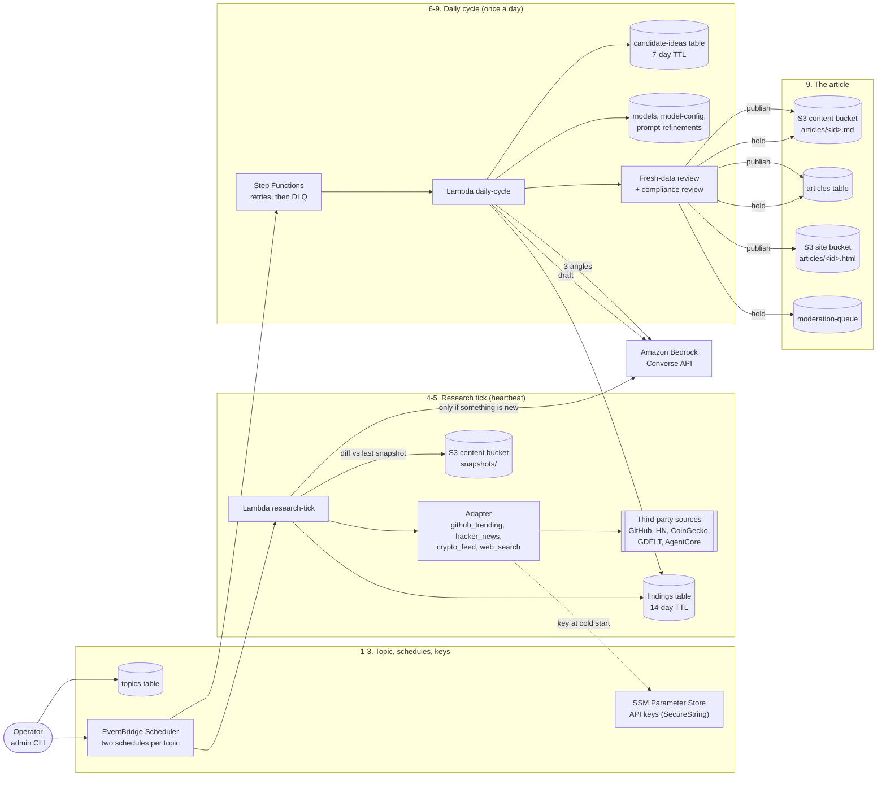

# Article research

How a topic's data source becomes a published article: where the adapters, the third-party API
keys, the Lambdas, the findings and the candidate ideas each come in, how they end up as an
article in S3, and where the AI agents fit.

The operator's assistant explains the same thing, with this environment's resource names on
screen. Ask it "how is an article researched?" (it calls `architecture` with `feature`
`article-research`). The rules this follows are in the [README](../../README.md#hard-constraints-enforced-in-code-not-just-documented):
research is diff-first, nothing is published without a review, financial topics always go to a
person, and new sources are added as adapters.

Resource names below use `<prefix>` (your `unique_name_prefix`) and `<env>` (`dev` or
`production`).

## The steps

| # | Step | What happens | Where in the code / infra |
|---|---|---|---|
| 1 | **Topic and adapter** | A topic is a row of settings created with the admin CLI: which adapter reads its source, how often to research, its model and review mode. The adapter is the only code that knows anything about the source. | `topics` table; `lambdas/common/adapters/` (`base.py` is the contract, `registry.py` maps names to classes) |
| 2 | **Schedules** | Creating a topic creates two EventBridge Scheduler schedules: a research heartbeat at its interval, and the daily cycle at its time and timezone. Topics are runtime data, not Terraform. | `lambdas/common/scheduler.py`, called by `admin_api_handler.py`; `<prefix>-<env>-<topic_id>-research-tick` / `-daily-cycle` |
| 3 | **Third-party sources and their keys** | API keys are SecureStrings in SSM Parameter Store. Terraform sets an environment variable that holds each parameter's *name*, and the Lambda reads the value at cold start. Keys are never in code, tables or logs. Both keys are optional. News search uses GDELT, which needs no key, and falls back to Bedrock AgentCore web search, which the Lambda's IAM role authorises. | `COINGECKO_API_KEY_PARAMETER` (`crypto_feed.py`), `GITHUB_API_TOKEN_PARAMETER` (`github_trending.py`), `lambdas/common/web_search.py`; [how to store a key](../deployment-runsheet.md#api-keys-for-the-data-sources) |
| 4 | **Research tick: diff first** | The adapter fetches the source and `material_diff` compares it with the last snapshot. If nothing is new, the tick stops and no model is called. If something is new, the raw snapshot is stored. | `lambdas/research_tick_handler.py`; `<prefix>-<env>-content` bucket, `snapshots/<topic_id>/<captured_at>.json` (expires after 21 days) |
| 5 | **Findings** | Bedrock summarises only what is new. The summary is written as a finding, along with where its snapshot is and its source references. | `<prefix>-<env>-findings` (expires after 14 days) |
| 6 | **Candidate ideas** | Once a day, the daily cycle runs through its state machine (two retries, then the dead-letter queue). It reads every finding since the topic's last article and asks Bedrock for three candidate angles. It stores them as candidate ideas and selects one. | `lambdas/daily_cycle_handler.py`; `<prefix>-<env>-daily-cycle` state machine; `<prefix>-<env>-candidate-ideas` (expires after 7 days) |
| 7 | **Drafting** | Bedrock drafts the title and the article with the topic's model from the model registry. The draft folds in the topic's approved prompt refinements (the bear's gear), an excerpt of a top-voted past article, and financial guidance where it applies. | `lambdas/common/model_routing.py`, `gear.py`, `equipment.py`, `compliance.py`; `models`, `model-config`, `prompt-refinements` tables |
| 8 | **Reviews** | A fresh-data review checks the draft's claims against what the source says now. A compliance review then decides whether to publish or hold. A financial topic is always held for a person, whatever the review says. | `lambdas/common/fresh_review.py`, `lambdas/common/compliance.py` |
| 9 | **The article in S3** | The body is written to the content bucket. The article's row records its lineage, tokens and cost, and the week's totals go to the Stats tables. A published article also gets a static page in the site bucket. A held article waits in the moderation queue for `admin_cli approve`. | `articles/<id>.md` in the content bucket; `articles` table; `articles/<id>.html` in the site bucket (`common/static_pages.py`); `moderation-queue`; `stats-current` |

Every Bedrock call goes through `lambdas/common/bedrock.py`, which records tokens and cost. That is
how each article's lineage, and the public Stats page, know what an article cost.

## Where the AI agents are

None of the model calls above is an agent. Each one is a single Bedrock Converse request made by a
Lambda: a summary, three angles, a draft, a review. The pipeline decides what happens next
in code, not by asking a model, which is why rules like "diff first" and "financial topics always
go to a person" cannot be talked around.

The one agent is the **operator's assistant**: a Strands agent (`<prefix>-<env>-ops-agent`) that
calls the MCP server's read-only tools (`<prefix>-<env>-ops-mcp`). Those tools read the same topics,
findings, candidate ideas and articles described here. They report what needs attention and
suggest admin CLI commands, but change nothing.

## Adding a source

A new source is a new adapter (`fetch_state`, `material_diff`, `source_refs`, and the `sources` it
credits), registered in `registry.py`. If it needs a key, the key goes in a new SSM parameter whose
name Terraform passes to the function. Nothing in steps 4 to 9 changes. See "Adding an adapter" in
[docs/project-plan.md](../project-plan.md) §6.
